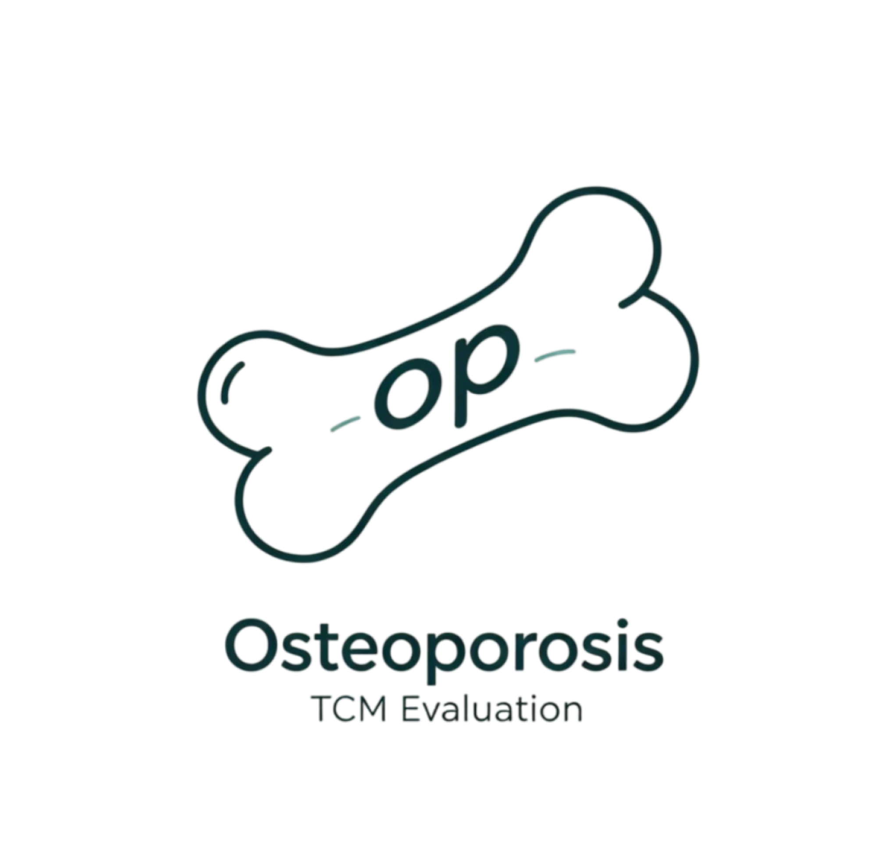

<p align="left">


<p align="center">
  
</p>

# OP-RAG: Method Workflow Reproducibility Package

A compact, research-only implementation of **Osteoporosis Prescription Retrieval-Augmented Generation (OP-RAG)**. The workflow evaluates a clinician-provided traditional Chinese medicine (TCM) regimen through three structured knowledge layers:

1. **Syndrome layer**: standardized TCM syndrome evidence.
2. **Formula layer**: syndrome–formula mappings and formula composition.
3. **Herb–target–pathway layer**: curated molecular-mechanism annotations.

It supports five progressive ablation settings (`G0`–`G4`) and produces auditable support, consistency, coverage, and evidence-chain-closure metrics. It is a research workflow, **not** a diagnosis, prescription, or clinical decision system.

## Scope and reproducibility statement

This repository reproduces the public **method workflow**: curated three-layer knowledge-base loading, G0–G4 ablation logic, metric definitions, optional Qwen-Plus report generation, and paper-result aggregation.

The original 50-case clinical evaluation set is not included because it contains restricted clinical source material. Therefore, the published 50-case numerical results are supplied only as aggregated records in `data/paper_results/`; they cannot be independently recalculated from patient-level inputs in this repository. The synthetic demonstration set contains no patient data and can be used to reproduce the complete software workflow.

| Component | Status |
| --- | --- |
| Three-layer public knowledge-base subset | Included |
| Synthetic end-to-end demonstration cases | Included |
| G0–G4 deterministic evaluation workflow | Included |
| Qwen-Plus report generation | Optional; requires a user-provided API key |
| Aggregated manuscript results | Included |
| Patient-level clinical inputs, reports, and contexts | Not included |

## Quick start

```bash
conda env create -f environment.yml
conda activate op-rag-open
python scripts/run_ablation.py
```

Outputs are written to `outputs/demo_ablation/`. The command runs the five ablation settings using local, deterministic reports; it does not make an API call.

## Optional Qwen-Plus report generation

Copy the example environment file and set a DashScope API key locally:

```bash
copy .env.example .env
```

```text
QWEN_API_KEY=your_dashscope_api_key
QWEN_BASE_URL=https://dashscope.aliyuncs.com/compatible-mode/v1
QWEN_MODEL=qwen-plus
```

Then run:

```bash
python scripts/run_ablation.py --use-qwen
```

The Qwen client uses the DashScope OpenAI-compatible endpoint with `qwen-plus` and `temperature=0.2`. Provider-side model revisions and nondeterministic remote generation can change report text over time. The quantitative metrics are computed by the local evaluation rules, not by parsing LLM output.

## Ablation settings

| Setting | Enabled components |
| --- | --- |
| G0 | Unaugmented report-generation baseline; no retrieval evidence |
| G1 | Syndrome-layer evidence |
| G2 | Syndrome and formula evidence |
| G3 | Syndrome, formula, and herb–target–pathway evidence |
| G4 | All three layers plus syndrome–formula consistency and evidence-chain closure assessment |

### Metrics

- **Formula KB support**: reference formula maps to the formula layer.
- **Herb-set Jaccard similarity**: overlap between reference herbs and herbs with mechanism annotations.
- **Core-herb mechanism coverage**: fraction of designated core herbs with mechanism annotations.
- **Any-level closure**: syndrome evidence, mapped formula, compatible syndrome–formula pairing, and at least one mechanism record are all present.
- **Core60 closure**: any-level closure plus core-herb mechanism coverage ≥ 0.60.
- **Strict closure**: primary syndrome–formula consistency, core-herb coverage ≥ 0.80, and full-reference-herb coverage ≥ 0.80.

## Repository layout

```text
OP-RAG-open/
├── assets/                 # Project logo
├── data/
│   ├── kb/                 # Curated syndrome, formula, herb, map, and provenance files
│   ├── demo/               # Synthetic educational cases only
│   └── paper_results/      # Aggregated manuscript outputs; no patient-level data
├── scripts/
│   └── run_ablation.py     # End-to-end G0–G4 workflow
├── src/op_rag/             # Retrieval, evaluation, prompting, and optional LLM client
├── tests/                  # Schema and workflow tests
└── outputs/                # Generated files, ignored by Git
```

## Knowledge-base provenance and limitations

The curated records are derived from the sources listed in `data/kb/references.json`. They are structured for reproducible computational evaluation, not intended to be an exhaustive clinical knowledge base. Mechanistic annotations summarize curated network-pharmacology evidence and do not establish clinical efficacy or causality.

## Citation

If you use this implementation, cite the associated OP-RAG manuscript. Before the manuscript is published, replace the placeholder below with the final bibliographic record or repository DOI:

```text
[Authors]. OP-RAG: A three-layer traditional Chinese medicine knowledge-enhanced evaluation and explanation system for primary osteoporosis. [Journal]. [Year].
```

## Ethics and data governance

This public package contains no patient-level data, clinical narratives, individual reports, or potentially identifying records. The source clinical dataset is restricted and is not distributed through this repository.

## License

Code and project-owned documentation are released under the [MIT License](LICENSE). The project logo is an original project asset distributed under the same license. Third-party knowledge sources remain subject to their respective terms and citation requirements.

## Disclaimer

This software is for research and educational use only. It must not be used as a substitute for professional medical judgment, diagnosis, treatment planning, or prescription decisions.
